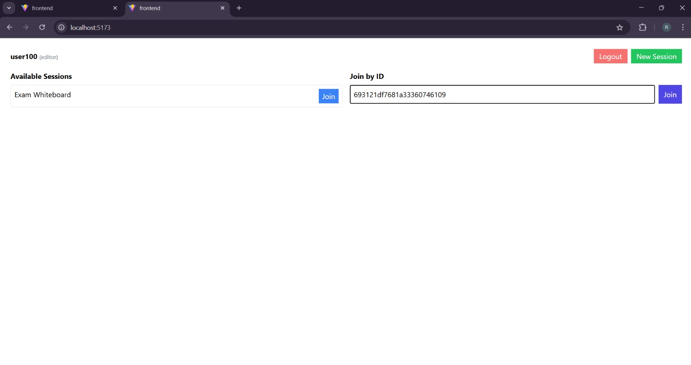
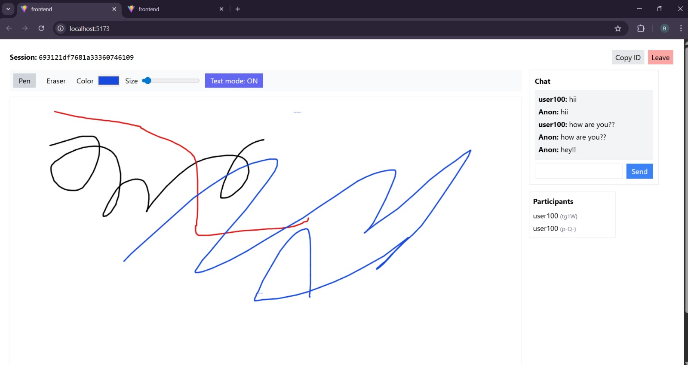
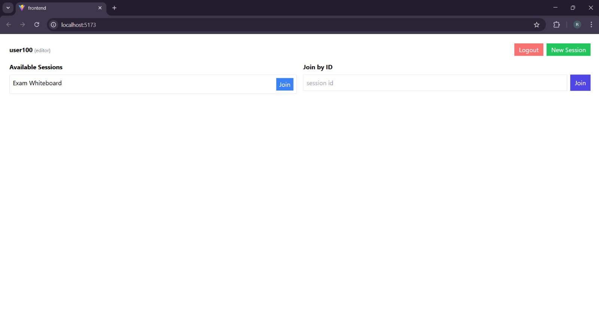
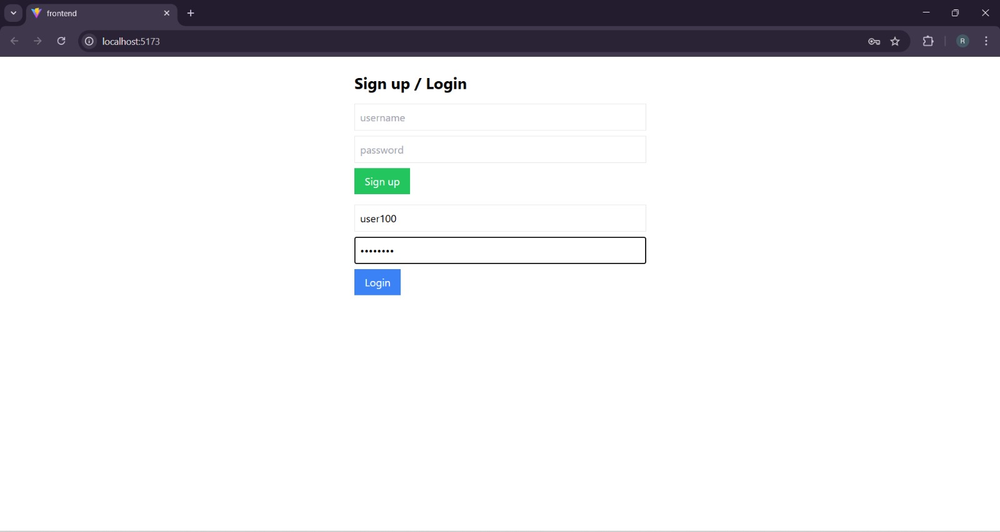

# 🎨 CollabBoard – Real-Time Collaborative Whiteboard

## 👥 Team Members

| Name | Role |  |
|------|------|--------|
| **Gourav Sharma** | Frontend + Documentation | 
| **Pragati Varshney** | Backend |
| **Rachit Upadhyay** | Frontend _ socket |
| **Shubhang gourav Mishra** | Backend | 
| **Alok Bhadauria** | Frontend _ UI| 

> A full-stack, real-time collaborative whiteboard for remote teams, classrooms, and creators.  
> Draw, chat, annotate, and share ideas — all in one place.

<p align="center">
  
</p>

<p align="center">
  
  
  
  
</p>

---

## 🔥 Problem Statement

With remote collaboration now an essential part of work and learning, existing whiteboard tools often suffer from:

- ❌ High cost / premium restrictions  
- ❌ Poor real-time performance  
- ❌ Limited sharing or export options  
- ❌ Lack of persistence and session history  

➡️ **CollabBoard** solves this by providing a **free**, **open-source**, and **real-time** collaborative digital whiteboard with drawing, chat, storage, and export functionality.

---

## ❓ Why CollabBoard?

| Challenge | CollabBoard Solution |
|----------|---------------------|
| Difficult/paid tools | Simple UI, 100% open-source |
| Sync delays & glitchy UX | Fast low-latency WebSockets |
| Work doesn’t persist | Save + restore anytime |
| Lack of collaboration | Live cursors, chat, presence |
| Limited sharing options | Export as PNG/JPEG/PDF |

> If **Miro + Jamboard + MS Whiteboard** merged as open-source → **CollabBoard** 🚀

---

## ✨ Features

### 👥 User Features
- Authentication (Signup/Login)
- Create & join sessions via link/code
- Pencil, shapes, text, sticky notes, colors & eraser
- Real-time collaboration with Socket.io
- In-session chat
- Export whiteboard: PNG / JPEG / PDF
- Save session & reopen later

### 🛡 Admin Features
- User moderation (ban/deactivate)
- Edit permissions control
- Insights & analytics dashboard

---

## 🏗 System at work

<p align="center">
  
</p>

---

## 🧰 Tech Stack

| Layer | Technology |
|------|------------|
| Frontend | React (Vite), Tailwind CSS, HTML5 Canvas |
| Backend | Node.js + Express.js |
| Real-time | Socket.IO |
| Database | MongoDB (Mongoose) |
| Auth | JWT Authentication |

---

## 📂 Folder Structure

```bash
team-19-project/
│
├── frontend/              # Frontend app
│   ├── public/
│   ├── src/
│   │   ├── assets/
│   │   ├── App.jsx
│   │   ├── services/api.js  # API helpers
│   │   └── index.css/
│   └── vite.config.js
│
├── server/              # Backend app
│   ├── controllers/
│   ├── models/
│   ├── routes/
│   ├── socket/
│   └── server.js
│
└── images/                # Screenshots / assets
```

## 🗄 Database Schema (MongoDB)

```json
// Session.js
const mongoose = require("mongoose");

const sessionSchema = new mongoose.Schema({
  name: String,
  owner: { type: mongoose.Schema.Types.ObjectId, ref: "User" },
  canvasData: String,
  createdAt: { type: Date, default: Date.now }
});

module.exports = mongoose.model("Session", sessionSchema);

// User.js
const mongoose = require("mongoose");

const userSchema = new mongoose.Schema({
  username: { type: String, unique: true },
  password: String,
  role: { type: String, enum: ["owner", "editor", "viewer"], default: "editor" }
});

module.exports = mongoose.model("User", userSchema);
```

## 🔐 Environment Variables

```json
PORT=5000
JWT_SECRET=mysupersecretkey123
MONGO_URI=mongodb://127.0.0.1:27017/mern_exam

```

## 📸 Screenshots

<p align="center">  </p> <p align="center"> 
 </p>